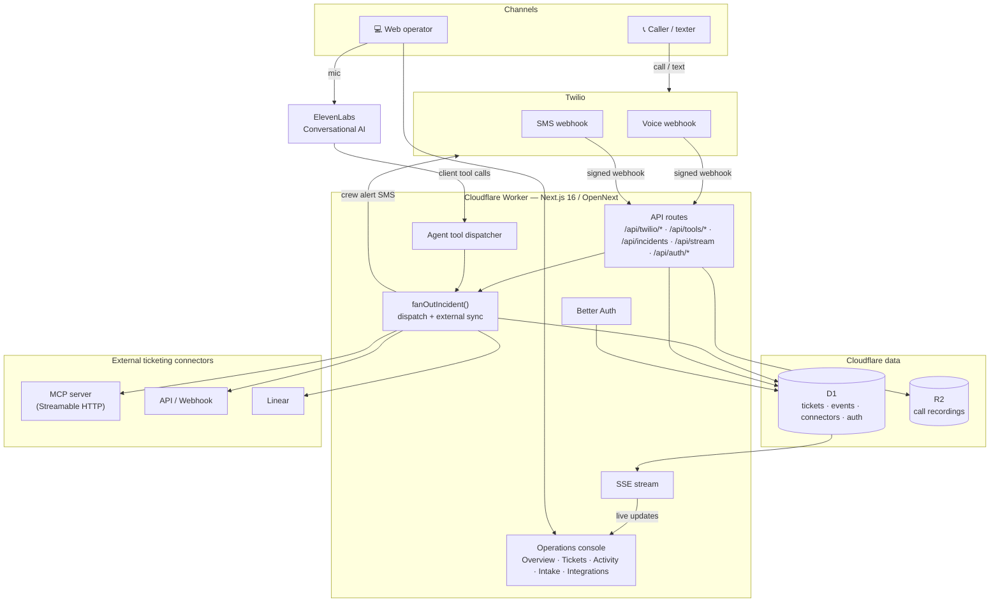
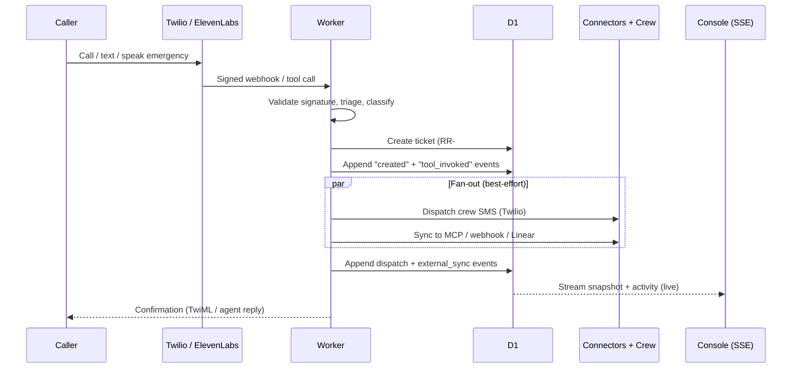

# Rebuild Relay

**Voice-AI emergency intake and dispatch for property restoration teams.**

A flood, fire, storm, or mold emergency — phoned in, texted, or spoken to the web agent — becomes a tracked, prioritized ticket and a dispatched crew in seconds, streamed live to an operations console and synced out to your existing ticketing system.

Live: **https://rebuild-relay.cfi-ops.workers.dev**

---

## What it does

- **Three intake channels, one pipeline** — inbound phone calls and SMS (Twilio) and a browser voice agent (ElevenLabs) all open the same structured ticket.
- **Agent tool-calling** — the voice agent drives the ticketing system through real server tools (`create_incident`, `update_incident`, `dispatch_crew`, `assign_ticket`, …) while the caller is still talking.
- **Real-time ops console** — tickets, stats, and a full activity/audit feed stream over Server-Sent Events; no polling.
- **Ticketing lifecycle** — human ticket numbers (`RR-1042`), P1–P4 priority, SLA clocks, assignees, and an append-only audit trail.
- **External connectors** — every incident syncs to your own ticketing system via a remote **MCP server**, a generic **API/webhook**, or **Linear**.
- **Auth** — email/password (Better Auth) gating the console.
- **Edge-native** — Next.js on Cloudflare Workers (OpenNext), with D1 and R2.

---

## Architecture



### Intake → dispatch flow



---

## Tech stack

| Layer | Technology |
|-------|-----------|
| Framework | Next.js 16 (App Router) + React 19 |
| Runtime | Cloudflare Workers via [OpenNext](https://opennext.js.org/cloudflare) |
| Database | Cloudflare D1 (SQLite) |
| Object storage | Cloudflare R2 (call recordings) |
| Auth | Better Auth (email/password) + Kysely D1 dialect |
| Voice (web) | ElevenLabs Conversational AI (`@elevenlabs/client`) |
| Telephony | Twilio Voice + SMS (REST over `fetch`, Web Crypto signature validation) |
| Real-time | Server-Sent Events |
| External sync | MCP Streamable-HTTP client · generic webhook · Linear GraphQL |
| UI | Tailwind CSS v4, lucide-react |
| Validation / tests | Zod, Vitest (Workers pool) |

---

## Project structure

```
src/
  app/
    (app)/                 # authenticated console (shared layout + realtime provider)
      page.tsx             #   Overview
      tickets/             #   Tickets queue
      activity/            #   Live activity log
      intake/              #   ElevenLabs voice console
      integrations/        #   External ticketing connectors
    login/                 # public sign-in / sign-up
    api/
      auth/[...all]/       # Better Auth handler
      twilio/              # voice, voice/collect, sms, status, recording webhooks
      tools/               # catalog, invoke, create-incident
      incidents/           # list + [id] status updates
      connectors/          # CRUD + [id]/test
      stream/              # SSE
      elevenlabs/          # signed-url, post-call
  components/
    dashboard/             # realtime provider, nav, stat cards, ticket queue, activity feed
    integrations/          # connector management UI
    voice/                 # voice console
    auth/                  # user menu
  lib/
    db.ts                  # D1 data layer (tickets, events, notifications)
    incident-schema.ts     # zod schema + ticketing types
    twilio.ts              # REST client, dispatch, signature validation
    connectors.ts          # connector CRUD + adapters + sync
    mcp-client.ts          # MCP Streamable-HTTP client
    intake.ts              # fanOutIncident (dispatch + sync)
    tools.ts               # agent tool catalog + dispatcher
    auth.ts                # Better Auth instance
migrations/                # 0001…0005 D1 migrations
```

---

## Data model (D1)

- **incidents** — tickets: ticket number, caller, address, damage type, severity, status, priority, SLA, assignee, source.
- **ticket_events** — append-only audit log powering the live feed (`created`, `status_changed`, `dispatch`, `tool_invoked`, `external_sync`, …).
- **notifications** — every inbound/outbound Twilio message + delivery status.
- **call_recordings** — recording metadata + R2 key.
- **connectors** / **ticket_links** — external ticketing integrations and the records they create.
- **user / session / account / verification** — Better Auth.

---

## Agent tools

Exposed for the ElevenLabs agent (catalog at `GET /api/tools`, executed via `POST /api/tools/invoke`):

`create_incident` · `update_incident` · `dispatch_crew` · `assign_ticket` · `add_note` · `lookup_incident` · `sync_to_ticketing` · `list_ticketing_connectors`

---

## Local development

```bash
npm install

# Apply D1 migrations to the local database
npx wrangler d1 migrations apply rebuild-relay --local

# Run the dev server (bindings available via OpenNext)
npm run dev
```

Local secrets go in `.dev.vars` (gitignored). For example:

```ini
PUBLIC_BASE_URL="http://localhost:3000"
BETTER_AUTH_SECRET="dev-secret"
TWILIO_PHONE_NUMBER="+15555550100"
TWILIO_SKIP_VALIDATION="1"   # dev only — bypasses webhook signature checks
```

Other useful scripts: `npm run typecheck`, `npm test`, `npm run build`.

---

## Deploy (Cloudflare)

```bash
# Apply migrations to the remote D1
npx wrangler d1 migrations apply rebuild-relay --remote

# Build with OpenNext and deploy
npm run deploy
```

### Secrets (production)

Set via `npx wrangler secret put <NAME>`:

| Secret | Purpose |
|--------|---------|
| `TWILIO_ACCOUNT_SID` | Twilio REST + webhook config |
| `TWILIO_AUTH_TOKEN` | Outbound REST **and** inbound webhook signature validation |
| `TWILIO_PHONE_NUMBER` | Emergency line (E.164) |
| `DISPATCH_NUMBERS` | Comma-separated on-call crew numbers |
| `ELEVENLABS_API_KEY` / `ELEVENLABS_AGENT_ID` | Web voice agent |
| `BETTER_AUTH_SECRET` | Session signing |
| `DISPATCH_API_KEY` | (optional) protects the public tool endpoint |

Point the Twilio number's **voice** webhook at `/api/twilio/voice` and its **messaging** webhook at `/api/twilio/sms`.

---

## Security

- Twilio webhooks are HMAC-SHA1 signature-verified (Web Crypto) and fail closed without the Auth Token.
- All credentials live in Wrangler secrets — never in the repo or bundle.
- The operations console and connector APIs are gated behind authentication.
- Connector secrets are redacted before being returned to the browser.
